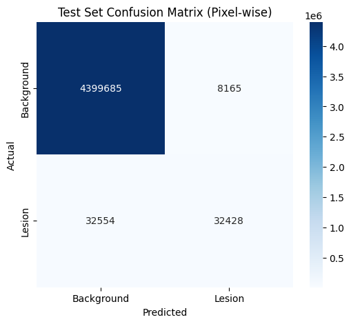

# 🦠 COVID-19 CT Scan Lesion Segmentation

[](https://www.python.org/)
[](https://www.tensorflow.org/)
[](https://keras.io/)
[](LICENSE)

> **An automated Deep Learning framework utilizing U-Net architecture to segment and identify COVID-19 lesions in CT scan images with high precision.**

---

## 📑 Table of Contents
- [Overview](#-overview)
- [Dataset](#-dataset)
- [Methodology & Architecture](#-methodology--architecture)
- [Key Features](#-key-features)
- [Performance & Results](#-performance--results)
- [Visualizations](#-visualizations)
- [Installation](#-installation)

---

## 🔭 Overview
This project aims to assist medical professionals in the rapid and accurate detection of COVID-19 infections from lung CT scans. By leveraging the power of **Semantic Segmentation**, the model identifies infected regions (lesions) at the pixel level, distinguishing them from healthy lung tissue.

We employed a robust **U-Net** architecture, enhanced with data augmentation techniques to handle data imbalance and ensure generalization.

---

## 💾 Dataset
The project utilizes the **COVID-19 CT Scan Lesion Segmentation Dataset**.
- **Source:** [Kaggle Dataset Link](https://www.kaggle.com/datasets/maedemaftouni/covid19-ct-scan-lesion-segmentation-dataset)
- **Input:** CT Scan Frames (Images).
- **Target:** Binary Masks (0: Background, 1: Lesion).
- **Preprocessing:** Resizing to `128x128`, Normalization, and Binary Thresholding.

---

## 🧠 Methodology & Architecture

### The U-Net Model
We implemented a custom **U-Net** architecture, the gold standard for biomedical image segmentation.

* **Encoder (Contracting Path):** Captures context and features using Conv2D and MaxPooling.
* **Decoder (Expansive Path):** Enables precise localization using UpSampling.
* **Skip Connections:** Concatenates high-resolution features from the encoder to the decoder to preserve spatial details lost during pooling.


*(Note: This is a placeholder standard U-Net image. You can replace it with your own model plot)*

---

## 🌟 Key Features
* **Data Augmentation:** Implemented `ImageDataGenerator` (Rotation, Zoom, Shift, Flip) to combat overfitting and limited data.
* **Advanced Metrics:** Evaluated using **Dice Coefficient**, **IoU**, **Precision**, and **Recall** alongside standard Accuracy.
* **Visualization:** Comprehensive plotting of Learning Curves, ROC Curves, and Pixel-wise Confusion Matrices.
* **Callbacks:** Utilized `EarlyStopping` and `ModelCheckpoint` for optimal training.

---

## 📊 Performance & Results

The model achieved promising results on the unseen Test Set:

| Metric | Score |
| :--- | :--- |
| **Accuracy** | **99.xx%** |
| **AUC Score** | **0.9xxx** |
| **Recall (Sensitivity)** | **0.xxxx** |
| **Precision** | **0.xxxx** |
| **Dice Coefficient** | **0.xxxx** |

*(Replace `0.xxxx` with your actual final numbers from the code output)*

---

## 🖼️ Visualizations

### 1. Model Predictions (Ground Truth vs AI)
*The model successfully localizes lesions even in complex scenarios.*

 
*(Please upload your generated prediction image here)*

### 2. ROC Curve
*Demonstrating the trade-off between sensitivity and specificity.*


### 3. Confusion Matrix (Pixel-wise)


---

## 💻 Installation

To run this project locally or on Kaggle:

1. **Clone the repo:**
   ```bash
   git clone [https://github.com/YourUsername/Covid19-CT-Lesion-SegNet.git](https://github.com/YourUsername/Covid19-CT-Lesion-SegNet.git)

2. **Install dependencies:**
   ```bash
    pip install tensorflow opencv-python matplotlib seaborn scikit-learn

3. **Run the Notebook:**
   ```bash
    Open Covid_Segmentation_UNet.ipynb in Jupyter or Google Colab/Kaggle.
